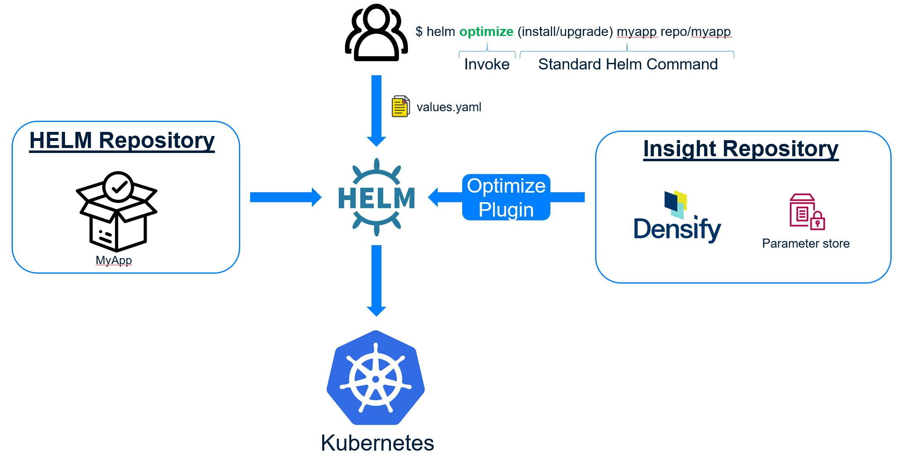

# Helm Optimize Resource Plugin

[](https://asciinema.org/a/Rxbp7rQpwEhGZ0G9Hx8HrFzNx)

### Introduction
This is a helmV3 plugin to optimize your container resources (CPU/Memory Requests/Limits) by injecting optimal specifications, extracted from an external parameter repository whenever helm is called to install or upgrade a chart.

When the plugin is utilized, the following operations are completed **in the specified order as needed** on each container within your helm application stack.  
1) Implement optimal specifications found in the parameter repository.
2) If the parameter repo is down or there is no optimal spec at the time of execution, then maintain the current configuration of container.  (i.e no changes)
3) If the container is not currently running (case INSTALL) or the container is currently running with no resource specification, then implement the default configuration found in the VALUES.yaml file(s)



### Prerequisites
- Densify account, which is provided with a Densify subscription or through a free trial (https://www.densify.com/service/signup)
- Linux/Windows client machine with kubectl and helm v3 installed and configured

**WINDOWS ONLY - Special Requirements** if you intend on using a Windows client, it is recommended that you install the plugin from WSL, MinGW64 or GIT Bash.
- [WSL](https://docs.microsoft.com/en-us/windows/wsl/install-win10)
- [Mingw-w64](http://mingw-w64.org/doku.php/start)
- [GIT Bash](https://gitforwindows.org/)

## Installation
Simply run the below command to install the plugin.
```sh
$ helm plugin install https://github.com/densify-dev/optimize-kubernetes-resources-helm/helm-optimize-resources
```
If your running this command from Windows command prompt, you will likely run into the following error.  To complete the install, navigate to the plugin directory ($HELM_PLUGINS\helm-optimize-resources) and execute install-binary.sh manually.  You can find your $HELM_PLUGINS directory by issuing the 'helm env' command.
```
Error: exec: "sh": executable file not found in %PATH%
```

### Developer (From Source) Install

If you would like to handle the build yourself, instead of fetching a binary, this is how we recommend doing it.

- Make sure you have [Go](http://golang.org) installed.

- Clone this project

- In the project directory run
```sh
$ go build helm-optimize-resources.go
```

## Usage
Once installed, the plugin is made available through the 'optimize' keyword which is passed in as the first parameter to helm.  Here is an output of the helm command after the plugin is installed.  Note the availability of a new command '*optimize'.
```
Available Commands:
  completion  generate autocompletion scripts for the specified shell
  create      create a new chart with the given name
  dependency  manage a chart's dependencies
  env         helm client environment information
  get         download extended information of a named release
  help        Help about any command
  history     fetch release history
  install     install a chart
  lint        examine a chart for possible issues
  list        list releases
**optimize    optimize resource spec of running containers during an install or upgrade
  package     package a chart directory into a chart archive
  plugin      install, list, or uninstall Helm plugins
  pull        download a chart from a repository and (optionally) unpack it in local directory
  repo        add, list, remove, update, and index chart repositories
  rollback    roll back a release to a previous revision
  search      search for a keyword in charts
  show        show information of a chart
  status      display the status of the named release
  template    locally render templates
  test        run tests for a release
  uninstall   uninstall a release
  upgrade     upgrade a release
  verify      verify that a chart at the given path has been signed and is valid
  version     print the client version information
```
You can call the plugin by issuing commands in the following format.
```
helm optimize [OPTIONS]
helm optimize [HELM COMMAND]
```
### Options
To access plugin options use the following format.
```
helm optimize [OPTION] [(optional) SUB-OPTIONS...]
-c (use this command to invoke a wizard to configure the parameter repo adapter.)
  SUB-OPTIONS
  --adapter (use this to manually configure adapter)
  --cluster-mapping (use this to manually configure cluster mapping)
  Eg. helm optimize -c --adapter
  Eg. helm optimize -c --cluster-mapping

-a <release_name> <chart_path/url> (use this to manage the approval settings through your configured repository)
  Eg. helm optimize -a chart chart_path/
  
-h, --help, help
  use this to get more information about the optimize plugin for helm
```
### Optimization
Simply use helm as you normally would, but add the 'optimize' keyword before any command.  The plugin will lookup the optimal resource spec from the configured repository.
To optimize your container resources when installing or upgrading a chart, use the following format.
```
helm optimize [HELM COMMAND]
Eg. helm optimize (install/upgrade) chart chart_dir/ --values value-file1.yaml -f value-file2.yaml
```
Again, the "HELM COMMAND" is nothing more than your normal helm install or upgrade command.

## License
See the LICENSE file for more info.